# 5 Minutes Stacks, épisode 27 : Toolbox (Beta) #

## Episode 27 : Toolbox (Beta)

This first version of the toolbox (Beta) is a different stack of everything the team was able to share with you so far.This aims to bring you a set of tools to **unify, harmonize and monitor your tenant**. In fact it contains a lot of different applications that aims to help you manage day by day of your instances:
* Monitoring and Supervision
* Log management
* Jobs Scheduler
* Mirror ClamAV - Antivirus
* Mirror yum and apt
* Time synchronization

This toolbox has been completely developed by the CAT team ( Cloudwatt Automation Team).
* The user interface is made ​​with react technology;
* it base on a CoreOS instance
* all applications are deployed via Docker containers on a Kubernetes infrastructure.
* Also you can install or configure, from the GUI, all the applications on your instances via Ansible playbooks.

To secure maximum toolbox that no port is exposed on the internet except port 22 in order to download a Openvpn configuration file. This method is explained later in the article.


## Preparations

### The prerequisites

These should be routine by now:
 * Internet access
 * A Linux shell
 * A [Cloudwatt account](https://www.cloudwatt.com/cockpit/#/create-contact) with a [valid keypair](https://console.cloudwatt.com/project/access_and_security/?tab=access_security_tabs__keypairs_tab)
 * The tools of the trade: [OpenStack CLI](http://docs.openstack.org/cli-reference/content/install_clients.html)
 * A [OpenVPN](https://openvpn.net/) client

### Initialize the environment

This will be useful to start the secure VPN connection.

Have your Cloudwatt credentials in hand and click [HERE](https://console.cloudwatt.com/project/access_and_security/api_access/openrc/).
If you are not logged in yet, you will go thru the authentication screen then the script download will start. Thanks to it, you will be able to initiate the shell accesses towards the Cloudwatt APIs.

Source the downloaded file in your shell. Your password will be requested.

~~~ bash
$ source COMPUTE-[...]-openrc.sh
Please enter your OpenStack Password:
~~~

Once this done, the Openstack command line tools can interact with your Cloudwatt user account.

## Install the toolbox

### The 1-click

This toolbox can be launch with the **1-click** of **Cloudwatt** via the web page [Apps page](https://www.cloudwatt.com/fr/applications/index.html) on the Cloudwatt website, choose the toolbox apps, press **DEPLOYER**.

After entering your login / password to your account, launch the wizard appears:

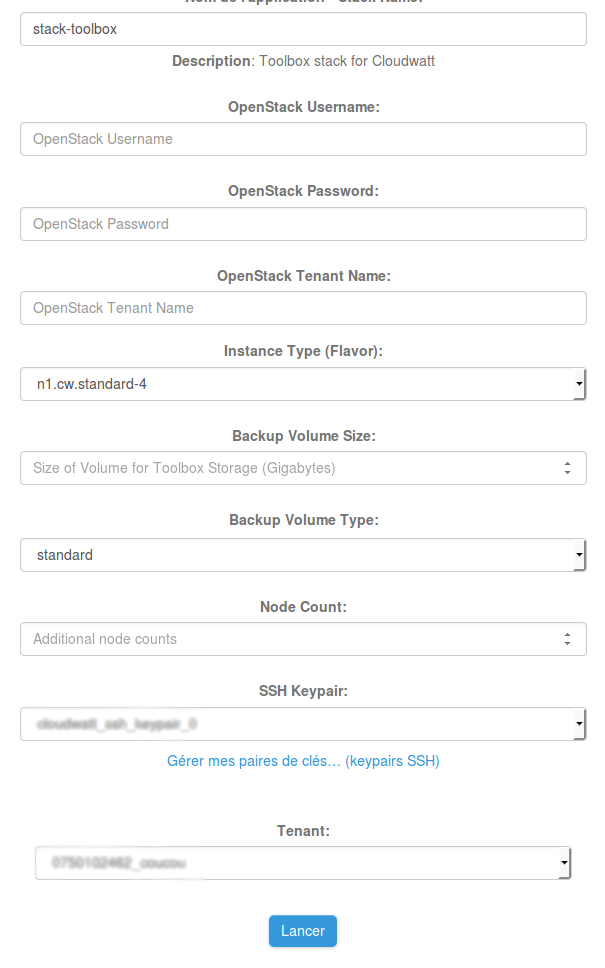


As you may have noticed the 1-Click wizard asked to reenter your password Openstack, this will be fixed in a future version of the toolbox.
You will find [her]((https://console.cloudwatt.com/project/access_and_security/api_access/view_credentials/) your **tenant ID**, it's  same as **Projet ID**.

By default, the stack deploys on an instance of type "standard-4" (n2.cw.standard-4). A variety of other instance types exist to suit your various needs, allowing you to pay only for the services you need. Instances are charged by the minute and capped at their monthly price (you can find more details on the [Pricing page](https://www.cloudwatt.com/en/pricing.html) on the Cloudwatt website).

You must indicate the type (standard or high performance ) and the size of the block volume that will be attached to your stack via the `volume_size` parameter.

Finally , you can set a number of nodes to distribute the load. By default, the toolbox will be deployed on 1 instance *master* and 1 *slave* node. At maximum, the toolbox v1 deploy on one instance *master* and 3 *slave* node.

Press **LANCER**.

The **1-click** handles launch the necessary calls on Cloudwatt API :

* Start an instance based on CoreOS,
* Create and attach a block volume,
* Start the **toolbox** container,
* Launch **SkyDNS** container

The stack is created automatically. You can see the progression clicking on its name which will take you to the Horizon console. When all modules become "green", the creation is finished.

Wait **2 minutes** that the entire stack is available.

### Finish OpenVPN access

Only remains for you to retrieve the configuration file **Openvpn** `cloud.ovpn` to complete the installation and have access to the toolbox.

* Download the client [OpenVPN](https://openvpn.net/index.php/open-source/downloads.html) choosing the client corresponding to the OS of your PC (windows, mac, linux).
* In a shell , run the command to retrieve the file `cloud.ovpn` :
```bash
scp -i ~/.ssh/your_keypair core@FloatingIP:cloud.ovpn .
```
If you work with Windows you will need to bring a downloadable customer Winscp [her](https://winscp.net/download/winscp577setup.exe).

* You must have your keypair and injected into the **Winscp** client, clicking on **Advanced** and then go into **SSH> Authentication**.
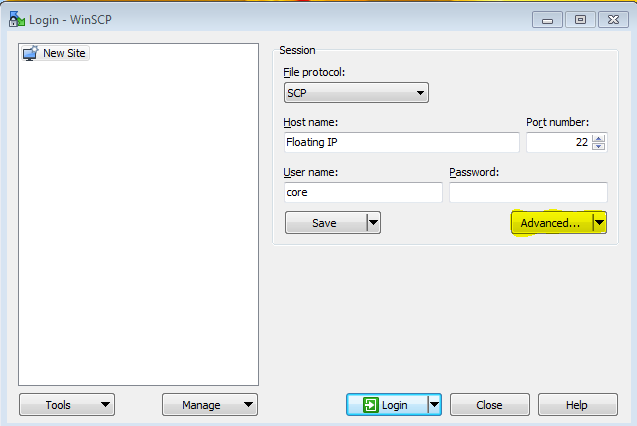
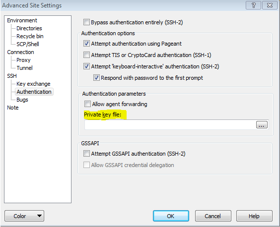


* By default the key is a `*.pem`. Winscp needs a `.ppk`. That is why it will offer to convert your key via PuTTYgen tool. Click OK to PuTTYgen starts.

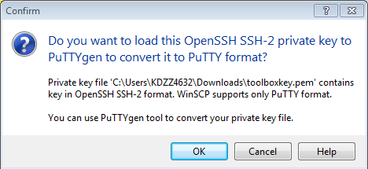

* Then click ` Save private key` and click on ` Yes` and place where you want on your post.

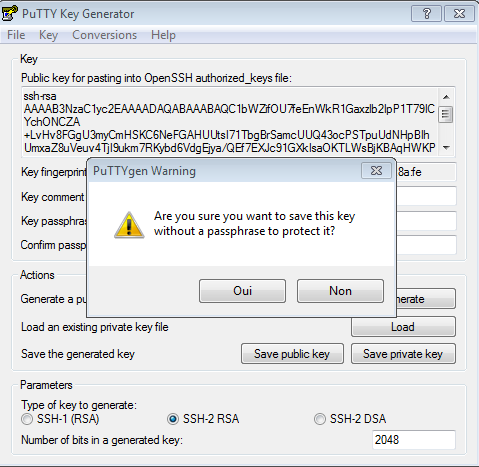
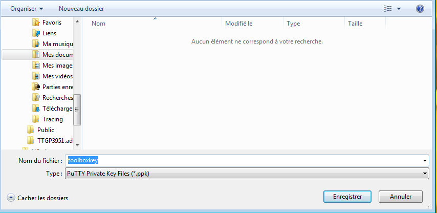

* You have to add `.ppk` key Winscp

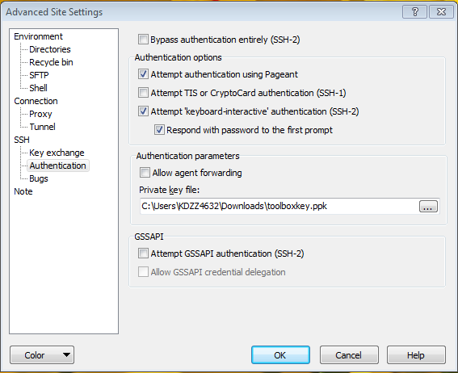

* You can now log in to the toolbox


* You must copy the `cloud.ovpn` file and open it with the customer Openvpn previously download.

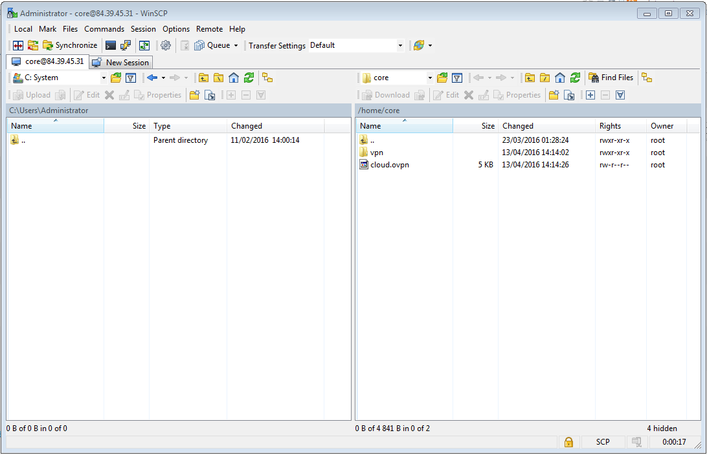

* Once this is done , add the configuration file to your Openvpn client (ex on windows, double click on `cloud.ovpn` file)

You can now access to the admin interface via l'url **http://manager** and begin to reap the benefit.

It's (already) over !


## Enjoy

Access to the interface and the various applications is via **DNS** names. Indeed a **SkyDNS** container is launched at startup allowing you to benefit all the short names in place. You can access different web interfaces for applications by clicking **Go** or via URL request (ex: http://zabbix/).

Also we attached a volume to your stack in order to save all **data** containers of the toolbox , so you can go back in a new instance. The volume is mounted on the master instance in the directory `/dev/vdb`.

#### Interface Overview

Here is the home of the toolbox, each thumbnail representing an application ready to be launched. In order to be as scalable and flexible as possible, all applications of this toolbox are containers Docker.

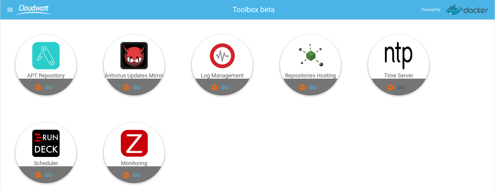

A menu is present in the top left of the page , it can move through the different sections of the toolbox , we'll detail them later .
* Apps: Application List
* Instances: list of visible instances of the toolbox
* Tasks : all ongoing or completed tasks
* Audit: list of actions performed
* My Instances> Console: access to the console Horizon
* My account> Cockpit access to my account

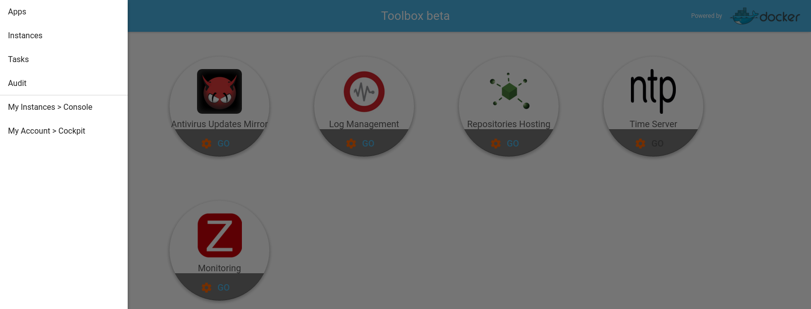

The **tasks** make the tracking of actions performed on the toolbox . It is reported in relative time.


All of these containers can be configured thanks to the **Settings** button  on each thumbnail.

As you can see, we have separated them into different sections.


In the **Info** section you will find a presentation of the application with some useful links on the application.


 In the **Environments** section you can register here all the parameters to be used to configure the variables of the container to its launch environment.
 

  In the **Parameters** section you can register here all the different application configuration settings.
  


To identify the applications running, we have set up a color code. An application will be started with a **green halo**.
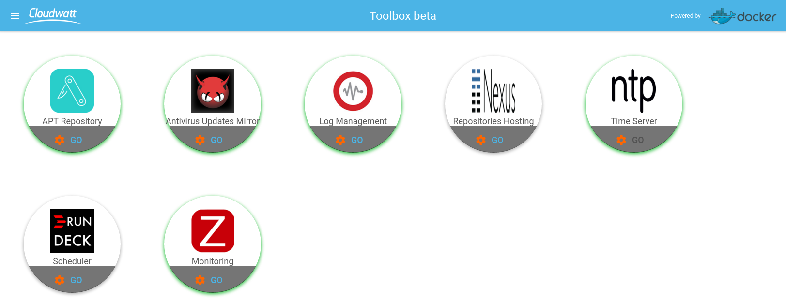

### Add instances to my Toolbox

To add instances to the toolbox, 3 steps:

  1. Attach your router instance of the toolbox
  1. Run the script attachment
  3. Start the desired services


#### 1. Attach the instance at the instance of router:

~~~bash
$ neutron router-interface-add $Toolbox_ROUTER_ID $Instance_subnet_ID
~~~

You will find all the information by inspecting the stack of resources via the command next heat :

~~~bash
$ heat resource-list $stack_name
~~~

Once this is done you are now in the ability to add your instance to the toolbox to instrumentalize .

#### 2. Start the attachment script:


Go to the **instance** menu and click the button  at the bottom right.


We offer two commands to choose: one **Curl** and one **Wget** copy into the instance to exploit in a shell.


Once the script is applied to the selected instance it should appear in the menu **instance** of your toolbox .


**Trick** If you want to create an instance via the console horizon Cloudwatt and declare **directly** in your toolbox, you should to select - in step 3 of the instance launch wizard - the toolbox network and - in step 4 - you can paste the **Curl** or **Wget** command in the Custom Script field. Don't forget to add the shebang `#!/bin/bash`.


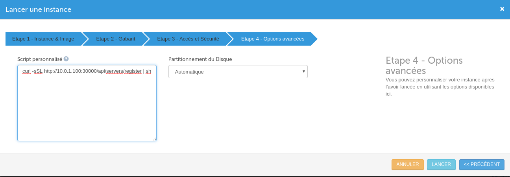


#### 3. Start the required services on the instance :

To help you maximum we created playbooks Ansible to automatically install and configure the agents for different applications.

To do this, simply click on the application you want to install on your machine. The playbook Ansible concerned will be automatically installed.
Once the application is installed, the application logo switch to color, allowing you to identify the applications installed on your instances.


It is possible for you to cancel pending on error spot in the **tasks** menu by clicking  which will then show you this logo .

We also implemented a **audit** section, so you can see all actions performed on each of your instances and export to Excel (.xlsx ). If you want to make a post-processing or keep this information for safety reasons via the button .


Finally, we integrated two links in the menu of the toolbox : **My instance** and **My Account**. They are respectively used to access to the Horizon Cloudwatt console and access to the Cockpit interface to manage your account.


## Services provided by applications

In this section, we will present the different services of this Toolbox.

### Monitoring and supervision
We have chosen to use Zabbix, the most popular application for monitoring, supervision and alerting .
Zabbix application is free software **to monitor the status of various network services , servers and other network devices**; and producing dynamic graphics resource consumption.
Zabbix uses MySQL, PostgreSQL or Oracle to store data. According to the large number of machines and data to monitor the choice of SGBD greatly affects performance. Its web interface is written in PHP and provided a real-time view on the collected metrics.

To go further, here are some helpful links :
* http://www.zabbix.com/
* https://www.zabbix.com/documentation/3.0/start

### Log Management

We chose Graylog which is the product of the moment for log management , here is a short presentation :
Graylog is an open source **log management** platform capable of manipulating and presenting data from virtually any source. This container is the offer officially by Graylog teams.
  * The Graylog Web Interface is a powerful tool that allows anyone to manipulate the entirety of what Graylog has to offer through an intuitive and appealing web application.
  * At the heart of Graylog is it's own strong software. Graylog Server interacts with all other components using REST APIs so that each component of the system can be scaled without comprimising the integrity of the system as a whole.
  * Real-time search results when you want them and how you want them: Graylog is only able to provide this thanks to the tried and tested power of Elasticsearch. The Elasticsearch nodes behind the scenes give Graylog the speed that makes it a real pleasure to use.

Enjoying this impressive architecture and a large library of plugins, Graylog stands as a strong and versatile solution for log management.

To go further, here are some helpful links :
* https://www.graylog.org/
* http://docs.graylog.org/en/1.2/pages/getting_started.html#get-messages-in
* http://docs.graylog.org/en/1.3/pages/architecture.html
* https://www.elastic.co/products/elasticsearch
* https://docs.mongodb.org/manual/tutorial/install-mongodb-on-ubuntu/


### Job Scheduler
We have chosen to use Rundeck.
The Rundeck application will allow you **to schedule and organize all jobs** that you want to deploy consistently on all of your holding via its web interface. In our case we wanted to give you the opportunity to set up a script to back up your servers as we saw in the *bundle* Duplicity (next version of the toolbox).

To go further, here are some helpful links :
* http://rundeck.org/
* http://blog.admin-linux.org/administration/rundeck-ordonnanceur-centralise-opensource-vient-de-sortir-sa-v2-0
* http://dev.cloudwatt.com/fr/blog/5-minutes-stacks-episode-vingt-trois-duplicity.html


### Mirror ClamAV - Antivirus
This application is a Ngnix server. A *CRON* script will run every day to fetch the latest **virus** definition distributed by ClamAV and then the recovered packet will be exposed to your instances via Ngnix. Allowing you to have customers **ClamAV** up to date without access internet.

To go further, here are some helpful links :
* https://www.clamav.net/documents/private-local-mirrors
* https://github.com/vrtadmin/clamav-faq/blob/master/mirrors/MirrorHowto.md


### APT mirror
To meet this need we have chosen to use Aptly.
This is a **APT package manager**. It allows you to mirror a web APT directory to distribute it to all your machines into which they do not necessarily  access to internet via a Nginx server.

To go further, here are some helpful links :
* https://www.aptly.info/
* http://korben.info/aptly-loutil-ultime-pour-gerer-vos-depots-debian.html/


###Mirror YUM
We have chosen to use Nexus.
Nexus is an application that can display any type of directory server via a Ngnix . Here our aim is to offer an application that can **expose a YUM repository** for all of your instances.

To go further, here are some helpful links :
* https://books.sonatype.com/nexus-book/reference/index.html
* https://books.sonatype.com/nexus-book/reference/yum-configuration.html


### Time Synchronisation
We have chosen to use NTP.
NTP container is used here so that all of your instances without access to the internet can be synchronized to the same time and access to **a server time**.

To go further, here are some helpful links :
  * http://www.pool.ntp.org/fr/

### The Toolbox versions **v1** (Beta)

  - CoreOS Stable 899.13.0
  - Docker 1.10.3
  - Zabbix 3.0
  - Rundeck 2.6.2
  - Graylog 1.3.4
  - Nexus 3.0
  - Nginx 1.9.12
  - Aptly  0.9.6
  - SkyDNS 2.5.3a
  - Etcd 2.0.3


## So watt ?

The goal of this tutorial is to accelerate your start. At this point **you** are the master of the stack.

You now have an SSH access point on your virtual machine through the floating-IP and your private keypair (default user name `core`).

**[Manager Toolbox](http://manager/)**


## And afterwards?

This article will acquaint you with this first version of the toolbox. It is available to all users Cloudwatt in **Beta mode** and therefore currently free.


The intention of the CAT ( Cloudwatt Automation Team) is to provide improvements on a monthly basis. In our roadmap, we expect among others:
* A French version
* Add the backup function
* HA Version
* An additional menu to contact Cloudwatt supporting teams
* many other things

Suggestions for improvement ? Services that you would like ? do not hesitate to contact us [apps@cloudwatt.com](mailto:apps@cloudwatt.com)

-----
Have fun. Hack in peace.

The CAT
