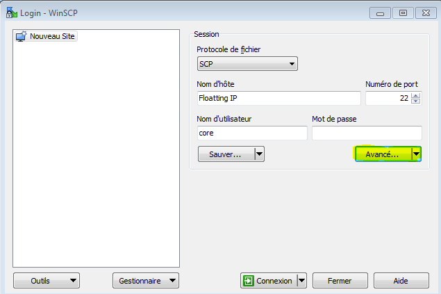
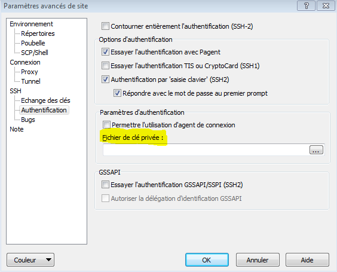

# 5 Minutes Stacks, épisode 27 : Toolbox (Beta) #

## Episode 27 : Toolbox (Beta)

Cette première version de la toolbox (version Beta) est une stack différente de tout ce que l'équipe a pu vous partager jusqu'à présent. Celle-ci a pour but de vous apporter un ensemble d'outils afin **d'unifier, d'harmoniser et monitorer votre tenant**. En effet celle-ci renferme un lot d'applications variées qui a pour vocation de vous aider dans la gestion au jour le jour de vos instances:
* Monitoring et Supervision
* Log management
* Planificateur de taches
* Miroir ClamAV - Antivirus
* Mirroir yum et apt
* Synchronisation de temps

Cette toolbox a entièrement été développée par l'équipe CAT (Cloudwatt Automation Team).
* Elle repose sur une instance CoreOS
* L'ensemble des applications se déploie via des conteneurs Docker sur une infrastructure Kubernetes
* L'interface utilisateur est construite en technologie React
* De plus vous pouvez installer ou configurer, depuis l'interface graphique, l'ensemble des applications sur vos instances via des playbooks Ansible.

Afin de sécuriser au maximum cette toolbox, aucun port n'est exposé sur internet mis à part le port 22 afin de pouvoir récupérer un fichier de configuration OpenVPN.


## Préparations

### Les pré-requis

 * Un accès internet
 * Un shell linux
 * Un [compte Cloudwatt](https://www.cloudwatt.com/cockpit/#/create-contact) avec une [ paire de clés existante](https://console.cloudwatt.com/project/access_and_security/?tab=access_security_tabs__keypairs_tab)
 * Les outils [OpenStack CLI](http://docs.openstack.org/cli-reference/content/install_clients.html)
 * Un client [OpenVPN](https://openvpn.net/)

### Initialiser l'environnement

Ceci vous sera utile pour lancer la connexion VPN sécurisée.

Munissez-vous de vos identifiants Cloudwatt, et cliquez [ICI](https://console.cloudwatt.com/project/access_and_security/api_access/openrc/).
Si vous n'êtes pas connecté, vous passerez par l'écran d'authentification, puis le téléchargement d'un script démarrera. C'est grâce à celui-ci que vous pourrez initialiser les accès shell aux API Cloudwatt.

Sourcez le fichier téléchargé dans votre shell et entrez votre mot de passe lorsque vous êtes invité à utiliser les clients OpenStack.

 ~~~ bash
 $ source COMPUTE-[...]-openrc.sh
 Please enter your OpenStack Password:
 ~~~

Une fois ceci fait, les outils de ligne de commande d'OpenStack peuvent interagir avec votre compte Cloudwatt.


## Installer la toolbox

### Le 1-clic

La Toolbox se lance par le **1-clic** de **Cloudwatt** via la page web
[Applications](https://www.cloudwatt.com/fr/applications/index.html) du site de Cloudwatt. Choisissez l'application Toolbox, appuyez sur **DEPLOYER**.

Après avoir entré vos login/password de votre compte, le wizard de lancement apparait :


Comme vous avez pu le constater le wizard du 1-Clic vous demande de saisir une nouvelle fois vos identifiants Openstack (cela sera fixé lors d'une prochaine version de la toolbox).
Vous trouverez [ici](https://console.cloudwatt.com/project/access_and_security/api_access/view_credentials/) votre **tenant ID**, il est identique a l'**ID du projet**. Il vous sera nécessaire pour compléter le wizard.

Par défaut, le wizard propose un déploiement sur une instance de type "standard-4" (n2.cw.standard-4). Il existe une variété d'autres types d'instances pour la satisfaction de vos multiples besoins. Les instances sont facturées à la minute, vous permettant de payer uniquement pour les services que vous avez consommés et plafonnées à leur prix mensuel (vous trouverez plus de détails sur la [Page tarifs](https://www.cloudwatt.com/fr/produits/tarifs.html) du site de Cloudwatt).

Vous devrez indiquer le type (standard ou performant) et la taille du volume bloc qui sera attaché à votre stack via le paramètre `volume_size`.

Enfin, vous pouvez définir un nombre de noeuds afin de répartir la charge. Par défault, la toolbox sera déployée sur 1 instance *master* sans noeud *slave*. Au maximum, la toolbox beta se déploie sur 1 instance *master* et 3 noeuds *slave*.

Appuyer sur **LANCER**.

Le **1-clic** s'occupe de lancer les appels nécessaires sur les API Cloudwatt pour :

* démarrer une instance basée sur CoreOS,
* créer et attacher un volume bloc standard ou performant selon votre choix,
* lancer le conteneur **toolbox**,
* lancer le conteneur **SkyDNS**

La stack se crée automatiquement. Vous pouvez en voir la progression en cliquant sur son nom ce qui vous menera à la console Horizon. Quand tous les modules deviendront « verts », la création sera terminée.

Attendez **2 minutes** que l'ensemble soit complètement initialisé.


### Finaliser l'accès OpenVPN

Ne vous reste plus qu'à récupérer le fichier de configuration **OpenVPN** `cloud.ovpn` pour finaliser l'installation et avoir l'accès à la toolbox.

* Télécharger le client [OpenVPN](https://openvpn.net/) en choisissant le client correspondant à l'OS de votre PC (windows, mac, linux).
* Dans un shell, lancer la commande pour récupérer le fichier `cloud.ovpn` :
```bash
scp -i ~/.ssh/your_keypair core@FloatingIP:cloud.ovpn .
```

Si vous travailler avec windows il faudra vous munir d'un client Winscp téléchargeable [ici](https://winscp.net/download/winscp577setup.exe).

* Il faut vous munir de votre keypair et l'injecter dans le client **Winscp** en cliquant sur **Avancé...** et ensuite aller dans **SSH > Authentification**.





* Une fois cette opération réalisée, ajouter le fichier de configuration à votre client OpenVPN (par exemple sur Windows, double cliquer sur fichier `cloud.ovpn`)

Vous pouvez maintenant accéder à l'interface d'administration de la toolbox via l'url **http://manager** et commencer à en tirer tout le bénéfice.

C’est (déjà) FINI !


## Enjoy

L'accès à l'interface et aux différents services se fait via des noms **DNS**. En effet un conteneur **SkyDNS** est lancé au démarrage ce qui vous permet de bénéficier de l'ensemble des noms courts mis en place. Vous pourrez accéder aux différentes interfaces web des applications en cliquant sur **GO** ou via une requête URL (par exemple : http://zabbix/).

Nous avons attaché un volume à votre stack afin de pouvoir sauvegarder l'ensemble des **data** des conteneurs de la toolbox, ce qui vous permettra de pouvoir le remonter sur une nouvelle instance. Le volume est monté sur l'instance master de la toolbox dans le répertoire `/dev/vdb`.


### Présentation de l'interface

Voici l'accueil de la toolbox: chaque vignette représente une application prête à être lancée. Afin d'être le plus scalable et flexible possible, les applications de cette toolbox sont des conteneurs Docker.


Grâce au menu présent en haut en gauche de la page, vous pouvez vous déplacer dans les différentes sections de la toolbox. Nous allons vous les détailler par la suite.
* Apps : liste des applications
* Instances : liste des instances visibles de la toolbox
* Tasks : ensemble des taches en cours ou terminées
* Audit : liste des actions effectuées
* My Instances > Console : accès à la console Horizon
* My account > Cockpit : accès à mon compte


Les **tasks** permettent un suivi des actions effectuées sur la toolbox. Elles sont indiquées en temps relatif.


L'ensemble des conteneurs présents sont paramétrables grâce au bouton **Settings**  présent sur chaque vignette.

Comme vous pouvez le constater, nous les avons séparés en différentes sections.
 

Dans la section **Infos** vous allez retrouver une présentation de l'application avec quelques liens utiles sur l'application concernée.


Dans la section **Environments** vous pouvez ici inscrire l'ensemble des paramètres qui serviront à configurer les variables d'environnement du conteneur à son lancement.


Dans la section **Parameters** vous pouvez ici inscrire l'ensemble des paramètres de configuration des différentes applications.


Afin d'identifier les applications lancées de celles qui ne le sont pas, nous avons mis en place un code couleur. Une application démarrée sera entourée d'un **halo vert**.


### Ajouter des instances à la Toolbox

Afin d'ajouter des instances à la toolbox, 3 étapes :

  1. Attacher votre instance au routeur de la toolbox
  2. Lancer le script d'attachement
  3. Lancer les services souhaités


#### 1. Attacher son instance au routeur de la toolbox :

 ~~~bash
 $ neutron router-interface-add $Toolbox_ROUTER_ID $Instance_subnet_ID
 ~~~

Vous retrouverez l'ensemble des informations en inspectant les ressources de la stack via la commande heat suivante :

~~~bash
$ heat resource-list $stack_name
~~~

Un fois ceci effectué vous êtes maintenant dans la capacité d'ajouter votre instance à la toolbox afin de l'instrumentaliser.


#### 2. Lancer le script d'attachement :

Dans la toolbox, aller dans le menu **instance** et cliquer sur le bouton  en bas a droite.

Nous proposons 2 commandes au choix: un **Curl** et un **Wget**. Copiez la sur l'instance à instrumentaliser dans un shell.


Une fois le script appliqué sur l'instance choisie, elle apparait dans le menu **instance** de votre toolbox.


**Astuce :** Si vous souhaitez créer une instance via la console horizon Cloudwatt et la déclarer **directement** dans votre toolbox, il vous faut sélectionner - à l'étape 3 du wizard de lancement d'instance - le réseau de la toolbox et - à l'étape 4 - coller la commande **Curl** ou **Wget** dans le champ Script personnalisé.


#### 3. Lancer les services souhaitées sur l'instance :

Afin de vous aider au maximum, nous avons créé des playbooks Ansible permettant d'installer et configurer automatiquement les agents des différentes applications sur vos instances.

Pour cela il suffit de cliquer sur la ou les application(s) que vous souhaitez installer sur votre machine. Le playbook Ansible concerné va s'installer automatiquement.
Ceci fait, le logo de l'application passe en couleur, ce qui vous permet, d'un simple coup d'oeil, d'identifier les applications en fonctionnement sur vos instances.


Il vous est possible d'annuler une tache en attente en cas d'erreur dans le menu **tasks** en cliquant sur  ce qui vous affichera ensuite ce logo .

Nous avons aussi mis en place une section **audit** afin que vous puissiez voir l'ensemble de actions effectuées sur chacune de vos instances et un export en Excel (.xlsx) si vous souhaitez effectuer un post-processing ou garder ces informations pour des raisons de sécurité via le bouton  .


Enfin, nous avons intégré 2 liens dans le menu de la toolbox : **My Instances** et **My Account**. Ils servent respectivement à accéder à la console Horizon Cloudwatt et à la gestion de votre compte via l'interface Cockpit.


## Les Services fournis par les applications

Dans cette section, nous allons vous présenter les différents services de cette Toolbox.

### Monitoring et Supervision
Nous avons choisi d'utiliser Zabbix, l'application la plus en vogue pour le monitoring, supervision et alerting.
L'application Zabbix est un logiciel libre permettant de **surveiller l'état de divers services réseau, serveurs et autres matériels réseau**; et produisant des graphiques dynamiques de consommation des ressources. Zabbix utilise MySQL, PostgreSQL ou Oracle pour stocker les données. Selon l'importance du nombre de machines et de données à surveiller, le choix du SGBD influe grandement sur les performances. Son interface web est écrite en PHP et fourni une vision temps réel sur les métriques collectées.

Pour aller plus loin voici quelques liens utiles:
  * http://www.zabbix.com/
  * https://www.zabbix.com/documentation/3.0/start

### Log Management
Nous avons choisi Graylog qui est le produit du moment pour la gestion des logs, en voici une petite présentation :
C'est une plateforme open source de **gestion de logs** capable de manipuler et présenter les données à partir de pratiquement n'importe quelle source. Ce conteneur est celui proposer officiellement par les équipes Graylog.
  * L'interface graphique web de Graylog est un outil puissant qui permet à quiconque de manipuler la totalité de ce que Graylog a à offrir grâce à cette application Web intuitive et attrayante.
  * Le cœur de Graylog est son moteur. Le serveur Graylog interagit avec tous les autres composants à l'aide d'interfaces API REST de sorte que chaque composant du système peut être adapté sans pour autant compromettre l'intégrité du système dans son ensemble.
  * Des résultats de recherche en temps réel quand vous les voulez et comment vous les voulez: Graylog est en mesure de vous fournir ceci grâce à la puissance éprouvée d'ElasticSearch. Les nœuds ElasticSearch donnent à Graylog la vitesse qui en fait un vrai plaisir à utiliser.

Bénéficiant de cette architecture impressionnante ainsi que d'une vaste bibliothèque de plugins, Graylog se place comme une solution solide et polyvalente de gestion des logs.

Pour aller plus loin voici quelques liens utiles:
  * https://www.graylog.org/
  * http://docs.graylog.org/en/1.2/pages/getting_started.html#get-messages-in
  * http://docs.graylog.org/en/1.3/pages/architecture.html
  * https://www.elastic.co/products/elasticsearch
  * https://docs.mongodb.org/manual/tutorial/install-mongodb-on-ubuntu/


### Planificateur de taches
Pour répondre à ce besoin nous avons choisi d'utiliser Rundeck.
L'application Rundeck vous permet de **programmer et d'organiser l'ensemble des taches** que vous voulez déployer régulièrement sur  votre tenant via son interface web.

Dans une prochaine version de la toolbox, nous automatiserons la sauvegarde de vos serveurs comme nous l'avons vu dans le cadre du *bundle* Duplicity.

Pour aller plus loin voici quelques liens utiles:
  * http://rundeck.org/
  * http://blog.admin-linux.org/administration/rundeck-ordonnanceur-centralise-opensource-vient-de-sortir-sa-v2-0
  * http://dev.cloudwatt.com/fr/blog/5-minutes-stacks-episode-vingt-trois-duplicity.html


### Miroir ClamAV - Antivirus
Cette application est un serveur Ngnix. Un script *CRON* va s'exécuter chaque jour afin d'aller chercher la dernière définition des **virus** distribuées par ClamAV. Le paquet récupéré sera exposé à vos instances via Ngnix ce qui vous permettra d'avoir des clients **ClamAV** à jour sans que vos instances n'aient forcément accès à internet.

Pour aller plus loin voici quelques liens utiles:
  * https://www.clamav.net/documents/private-local-mirrors
  * https://github.com/vrtadmin/clamav-faq/blob/master/mirrors/MirrorHowto.md


### Miroir APT
Pour répondre à ce besoin nous avons choisi d'utiliser Aptly.
C'est un **gestionnaire de paquet APT**. Il permet de faire un miroir d'un répertoire APT exposé sur internet afin de pouvoir le distribuer à l'ensemble des machines de votre tenant qui, elles, n'ont pas forcement accès à internet via un serveur Nginx.

Pour aller plus loin voici quelques liens utiles:
  * https://www.aptly.info/
  * http://korben.info/aptly-loutil-ultime-pour-gerer-vos-depots-debian.html/


### Miroir YUM
Nous avons choisi d'utiliser Nexus.
Nexus est une application pouvant exposer n'importe quel type de répertoire via un serveur Ngnix. Ici notre volonté est de vous proposer une application pouvant **exposer un répertoire YUM** à l'ensemble de vos instances.

Pour aller plus loin voici quelques liens utiles:
  * https://books.sonatype.com/nexus-book/reference/index.html
  * https://books.sonatype.com/nexus-book/reference/yum-configuration.html


### Synchronisation de temps
Nous avons choisi d'utiliser NTP.
Le conteneur NTP est ici utilisé afin que l'ensemble de vos instances n'ayant pas accès à internet puissent être synchronisées à la même heure et aient accès à un **serveur de temps**.

Pour aller plus loin voici quelques liens utiles:
  * http://www.pool.ntp.org/fr/


## Les versions Toolbox **v1** (Beta)

  - CoreOS Stable 899.13.0
  - Docker 1.10.3
  - Zabbix 3.0
  - Rundeck 2.6.2
  - Graylog 1.3.4
  - Nexus 3.0
  - Nginx 1.9.12
  - Aptly  0.9.6
  - SkyDNS 2.5.3a
  - Etcd 2.0.3


## So watt  ?

Ce tutoriel a pour but d'accélerer votre démarrage. A ce stade **vous** êtes maître(sse) à bord.

Vous avez un point d'entrée sur votre machine virtuelle en SSH via l'IP flottante exposée et votre clé privée (utilisateur `core` par défaut).

**[Manager Toolbox](http://manager/)**


## Et la suite ?

Cet article permet de vous familiariser avec cette première version de la toolbox. Elle est mise à la disposition de tous les utilisateurs Cloudwatt en **mode Beta** et donc pour le moment gratuitement.

L'intention de la CAT (Cloudwatt Automation Team) est de fournir des améliorations sur une base mensuelle. Dans notre roadmap, nous prévoyons entre autre :
* une version francaise,
* ne plus avoir à resaisir ses identifiants,
* l'ajout de la fonction backup,
* une version HA,
* un menu additionnel pour contacter les équipes support Cloudwatt,
* la possibilité de la lancer sur notre deuxième région
* bien d'autres choses

Des suggestions d'améliorations ? Des services que vous souhaiteriez voir ? N'hésitez pas à nous contacter [apps@cloudwatt.com](mailto:apps@cloudwatt.com)

-----
Have fun. Hack in peace.

The CAT
